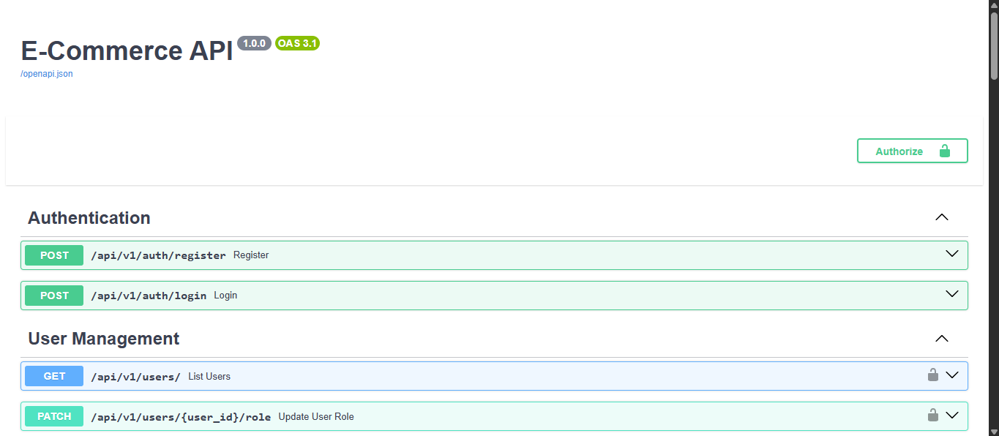
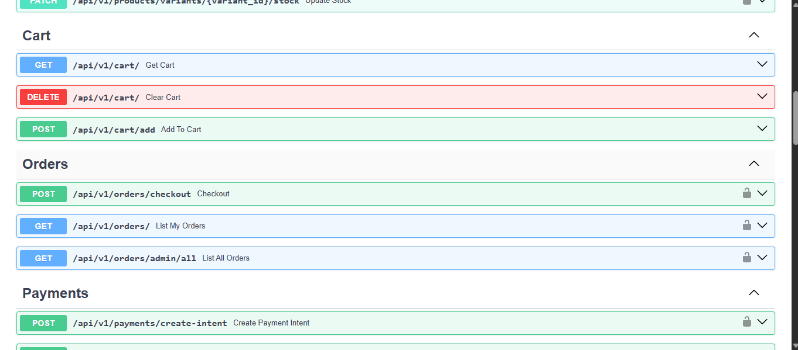

# 🛍️ E-Commerce REST API

A robust, production-ready backend API for an E-commerce platform built with **FastAPI**.  
Designed as a **modular monolith**, the system handles authentication, products, carts, orders, payments, and recommendations.

---

## ✨ Features

- 🔐 **Authentication & Authorization**
  - User & Admin roles
  - JWT-based authentication
  - Secure password hashing

- 🛒 **Product Catalog**
  - Products, categories, and variants (SKUs)

- 📦 **Inventory Management**
  - Row-level locking to prevent overselling
  - Real-time stock updates via WebSockets

- 🛒 **Shopping Cart**
  - Session-based cart stored in PostgreSQL (JSONB)

- 💰 **Order Processing**
  - Order lifecycle: `Created → Paid → Shipped`

- 💳 **Payments**
  - Stripe Payment Intents
  - Webhook support for payment confirmation

- 🎫 **Coupons & Discounts**
  - Fixed and percentage-based coupons
  - Usage tracking

- 📧 **Email Notifications**
  - Automated order confirmation emails (Gmail SMTP + Jinja2)

- 📊 **Recommendations**
  - Content-based product recommendation engine

- 📖 **API Versioning**
  - Clean `/api/v1` structure

---

## 📸 API Screenshots

### 🔹 Swagger UI – Main View


### 🔹 Authentication Endpoints



## 🛠️ Tech Stack

| Layer | Technology |
|-----|-----------|
| Backend | FastAPI (Async) |
| Database | PostgreSQL |
| ORM | SQLAlchemy 2.0 (Async) |
| Payments | Stripe |
| Email | Gmail SMTP |
| Realtime | WebSockets |
| Auth | JWT |

---

## 📦 Project Structure

```text
my_ecommerce_api/
├── app/
│   ├── api/
│   │   └── v1/
│   │       └── endpoints/
│   ├── core/
│   │   ├── email.py
│   │   └── security.py
│   ├── models/
│   ├── schemas/
│   ├── database.py
│   ├── config.py
│   └── main.py
├── templates/
│   └── email/
│       └── order_confirmation.html
├── requirements.txt
├── .env
├── .gitignore
└── README.md
````

---

## 🚀 Getting Started

### 1️⃣ Prerequisites

* Python **3.10+**
* PostgreSQL (local or cloud)
* Stripe account (test keys supported)

---

### 2️⃣ Installation

```bash
git clone https://github.com/KilaBean/my-ecommerce-api.git
cd my-ecommerce-api
```

```bash
python -m venv venv
source venv/bin/activate  # Windows: venv\Scripts\activate
```

```bash
pip install -r requirements.txt
```

---

### 3️⃣ Environment Configuration

Create a `.env` file:

```ini
# Database
POSTGRES_SERVER=localhost
POSTGRES_USER=postgres
POSTGRES_PASSWORD=password
POSTGRES_DB=ecommerce_db

# Security
SECRET_KEY=super_secret_key

# Stripe
STRIPE_API_KEY=sk_test_xxx
STRIPE_WEBHOOK_SECRET=whsec_xxx

# Email
EMAIL_USER=example@gmail.com
EMAIL_PASSWORD=gmail_app_password
EMAIL_FROM=example@gmail.com
```

---

### 4️⃣ Run the Server

```bash
uvicorn app.main:app --reload
```

Access:

* Swagger UI → [http://127.0.0.1:8000/docs](http://127.0.0.1:8000/docs)
* ReDoc → [http://127.0.0.1:8000/redoc](http://127.0.0.1:8000/redoc)

---

## 📌 API Endpoints Overview

| Method | Endpoint                         | Description      | Auth    |
| ------ | -------------------------------- | ---------------- | ------- |
| POST   | `/api/v1/auth/register`          | Register user    | ❌       |
| POST   | `/api/v1/auth/login`             | Login (JWT)      | ❌       |
| GET    | `/api/v1/products/`              | List products    | ❌       |
| POST   | `/api/v1/products/`              | Create product   | ✅ Admin |
| GET    | `/api/v1/cart/`                  | View cart        | ❌       |
| POST   | `/api/v1/cart/add`               | Add to cart      | ❌       |
| POST   | `/api/v1/orders/checkout`        | Create order     | ✅ User  |
| POST   | `/api/v1/payments/create-intent` | Stripe payment   | ✅ User  |
| GET    | `/api/v1/recommendations/{id}`   | Related products | ❌       |

---

## 🧠 Architecture Notes

* Modular Monolith (easy to split into microservices later)
* Async-first design
* Transaction-safe inventory handling
* Ready for production scaling

---

### 💼 Recruiter Impact
This project already shows:
- Real payments (Stripe)
- Async SQLAlchemy
- WebSockets
- Real-world business logic

